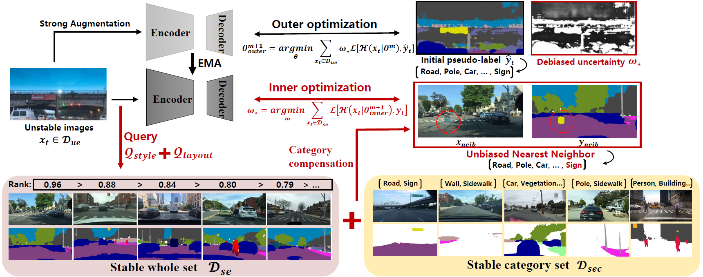

# SND
Stable Neighbor Denoising for Source-free Domain Adaptive Segmentation (CVPR-2024)

## :speech_balloon: Comparison with various uncertainty estimation methods


## :speech_balloon: Pipeline


## :speech_balloon: Requirements

```
Python 3.8.0
pytorch 1.10.1
torchvision 0.11.2
einops  0.3.2
```
Please see `requirements.txt` for all the other requirements.

### Getting started
Data:
- Download [The Cityscapes Dataset]( https://www.cityscapes-dataset.com/ )

The data folder should be structured as follows:
```
├── datasets/
│   ├── cityscapes/     
|   |   ├── gtFine/
|   |   ├── leftImg8bit/		
...
```
Pretrain models:
- Download pretrained model on GTA5:  ([GTA5_DG](https://drive.google.com/file/d/1fZ1uAPxUxPaWQrjBwZ6qkwsY3n2odqYd/view?usp=drive_link)) 
- Download pretrained model on  ([SYNTHIA_DG](https://drive.google.com/file/d/1_EhjzkcVClC_cjnar6r_tnpU3ZMB8nXG/view?usp=drive_link))
- 
Then, put these *.pth into the pretrain folder.

### Train
G2C-warm:
```
CUDA_VISIBLE_DEVICES=0 nohup python train_SND.py -cfg configs/deeplabv2_r101_dtst_G2C.yaml OUTPUT_DIR results/G2C_SND_WARM/ resume pretrain/G2C_model_iter020000.pth > logs/G2C_SND_WARM.file 2>&1 &
cp -r results/G2C_SND_WARM/ results/G2C_SND/
```
SND:
```
CUDA_VISIBLE_DEVICES=3 nohup python train_SND.py -cfg configs/deeplabv2_r101_SND_G2C_Full.yaml OUTPUT_DIR results/G2C_SND/ resume pretrain/G2C_model_iter020000.pth > logs/G2C_SND.file 2>&1 &\
```

Test:
```
CUDA_VISIBLE_DEVICES=1 python test.py -cfg configs/deeplabv2_r101_SND_G2C_Full.yaml resume results/G2C_SND/
```


### Acknowledge
Some codes are adapted from  [higher](https://github.com/facebookresearch/higher)
We thank them for their excellent projects.


### Citation
If you find this code useful please consider citing
```
@inproceedings{zhao2023towards,
  title={Towards Better Stability and Adaptability: Improve Online Self-Training for Model Adaptation in Semantic Segmentation},
  author={Zhao, Dong and Wang, Shuang and Zang, Qi and Quan, Dou and Ye, Xiutiao and Jiao, Licheng},
  booktitle={Proceedings of the IEEE/CVF Conference on Computer Vision and Pattern Recognition},
  pages={11733--11743},
  year={2023}
}

@InProceedings{Zhao_2024_CVPR,
    author    = {Zhao, Dong and Wang, Shuang and Zang, Qi and Jiao, Licheng and Sebe, Nicu and Zhong, Zhun},
    title     = {Stable Neighbor Denoising for Source-free Domain Adaptive Segmentation},
    booktitle = {Proceedings of the IEEE/CVF Conference on Computer Vision and Pattern Recognition (CVPR)},
    month     = {June},
    year      = {2024},
    pages     = {23416-23427}
}

```

